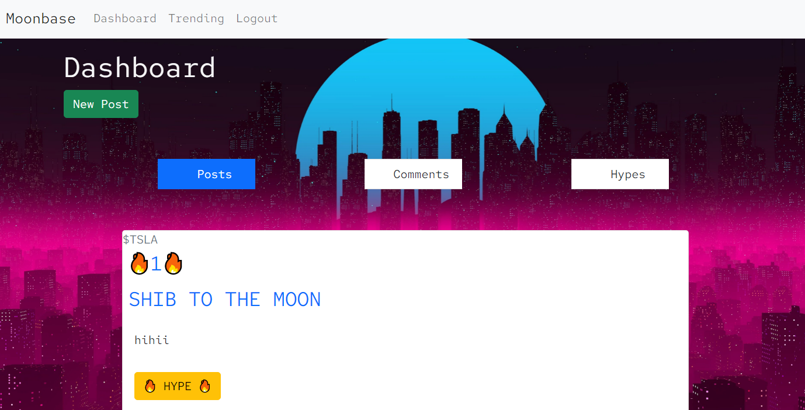

# Portfolio

## Description


This portfolio demonstrates some of the most recent projects I have worked on. Like the previous portfolio, it uses Bootstrap. It is responsive on mobile devices and features a different color scheme. In the contact section there is an updated resume which is available to view.

To view the portfolio, visit this [link](https://mushymane.github.io/portfolio-3/)

## Technologies Used
- HTML - used to structure and create elements on the DOM
- CSS - styles the HTML elements on page
- Bootstrap - CSS framework
- Git - version control
- Github - where the repository is hosted
- Visual Studio Code - text editor
- Font Awesome - amazing icons
- Google Fonts - for the Cairo and Quicksand fonts
- ScreenToGif - for recording short screen captures

## Code Snippets
HTML - Responsive project cards thanks to Bootstrap classes
```
<div class="row">
            <div class="col-lg-4 col-md-6 col-12 pb-5">
                <div class="card">
                    
                    <div class="card-body">
                        <h5 class="card-title">Moonbase</h5>
                        <p class="card-text">Finance forum with integrated stock data.</p>
                        <a href="https://guarded-chamber-67294.herokuapp.com/" class="btn btn-dark"
                            target="_blank">Live</a>
                    </div>
                </div>
            </div>
```
CSS - short and basic styling for the nav-links
```
.navbar-dark .navbar-nav .nav-link.active,
.navbar-dark .navbar-nav .nav-link:hover {
    color: rgb(179, 76, 76) !important;
}
```

## Author Links
[LinkedIn](https://www.linkedin.com/in/luigilantin/)
[Github](https://github.com/mushymane)